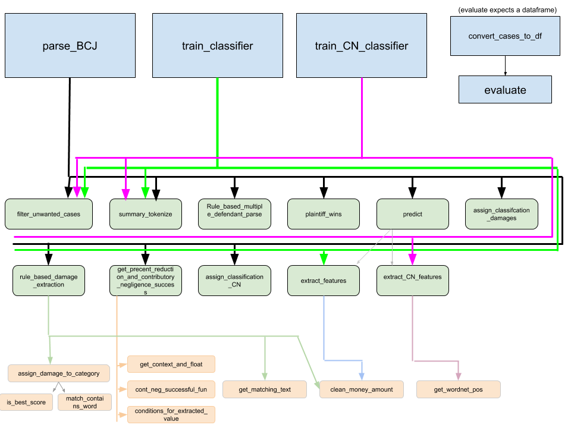

## Data Product README

### Purpose

This README is meant to be a reference guide for using our code to reproduce our results. This README is assuming you have read our report and have a working understanding of the project.

### Files

[key_functions.py](https://github.ubc.ca/nikihm/Capstone-project/blob/master/code/key_functions.py) - Contains majority of codebase. Includes all functions needed for rule-based & classification based information extraction. Also includes code to train classifiers and evaluate. See graphic at bottom of file for visual of how functions are inter-linked.

[visualize.ipynb](https://github.ubc.ca/nikihm/Capstone-project/blob/master/code/visualize.ipynb) - Contains all code used to create visualizations of our results.

[DOCX to TXT format.ipynb](https://github.ubc.ca/nikihm/Capstone-project/blob/master/code/DOCX%20to%20TXT%20format.ipynb) - Contains code to convert LexisNexus cases from .DOCX to .TXT

### Pre-Requisites

The programming language used for the entire project is Python 3. The following external packages need to be installed in order to run all code

**Data Manipulation Packages**
- Pandas*
- numpy*

**Machine Learning Packages**
- scikit-learn*
- XGBoost (Optional)

**Visualization Packages**
- matplotlib*
- Jupyter Notebook/Lab* (Optional)
- altair
- seaborn

*packages that are included if you install Python via the Anaconda distribution.

### Description

All code is located in the `/code/` folder. The main file needed to reproduce our visualizations can be found in `visualize.ipynb`. To open the notebook, you must have Jupyter Notebook or Jupyter Lab installed. The notebook has each cell producing a different type of chart. The charts will change depending on the model that is used to gather the results
 
All code required to reproduce our results can be found in `key_functions.py`. Functions in this file are required by `visualize.ipynb`. The file is organized into several functions - some of which are meant to be helper functions to others. The main pipeline most users will use is described below.

We have also included a saved copy of our best trained models in pickle format if you wish to skip the training part. The saved models are located under `code/saved_models/`. The relevant files are named, `damage_model.pkl`, `damage_vectorizer.pkl`, `damage_annotations.pkl`, `cn_model.pkl`, `cn_vectorizer.pkl`, `cn_annotations.pkl`. The following code snippet may be used to read in any of the pickle files:

```
with open('saved_models/damage_model.pkl', 'rb') as file:
    dmg_model = pickle.load(file)
```
##### Converting cases from .DOCX to .TXT

To convert the LexisNexus cases from .DOCX form to .TXT, use the `DOCX to TXT converter.ipynb` in the `/code/` folder. The only things the user needs to change is the path to where the documents are located. Follow instructions in the notebook for more information.

##### Train the classifiers on the same training data

The relevant function to train the damage classifier is `train_classifier(...)` where the function for contributory negligence is `train_CN_classifier(...)`. Both functions will take the path to the training data as the first argument and the classifier to use as the second. The functions will return the model, the vectorizer, and the gold annotations used to train it. The following parameters were used to train our best model. Warning: If you change any parameters (such as the classifier) it will produce different results. If the classifier does not implement `predict_proba`, some functionality will not work and may result in a crash.

`import key_functions as kf`

Damage Classifier

(Note: Adjust path to annotations as necessary. Annotations are located in `data/annotations/`)

`dmg_model, dmg_vectorizer, annotations = kf.train_classifier('../data/annotations/all_annotations_CN_headers.txt', clf = LogisticRegression(C = 1, penalty = 'l2', solver = 'newton-cg', max_iter = 1000, random_state=42), context_length = 6, fit_model=True)`

CN Classifier

`cn_model, cn_vectorizer, cn_annotations = kf.train_CN_classifier('../data/annotations/all_annotations_CN_headers.txt', clf = LogisticRegression(C = 1, penalty = 'l1', class_weight = 'balanced', solver = 'liblinear', max_iter = 10000, random_state = 42), context_length = 6) `

##### Run Classifier on Unseen Data

Next, run the classifier model on the rest of the dataset. The dataset is organized into 85 different text files that are titled `P1.txt`, `P2.txt`, ... `P85.txt`. The following code snippet gives an example of how to provide the path to the function `parse_BCJ` along with the classifier models. Make sure to adjust the path to the data as necessary. The function has many parameters that you can use to filter different types of results. **Note: You can run the rule-based approach by not supplying any damage or CN model to `parse_BCJ`**

```
# Setup path variables
path_to_data = '../data/Lexis Cases txt header/'
file_prefix = 'P'
file_suffix = '.txt'
file_identifiers = range(1, 86) # Range from 1 to 85

clf_results = []
for file_number in file_identifiers:
    print('## Processing ' + path_to_data + file_prefix + str(file_number) + file_suffix + ' ##', end='\r')
    clf_results.extend(kf.parse_BCJ(path_to_data + file_prefix + str(file_number) + file_suffix, damage_model = dmg_model, damage_vectorizer = dmg_vectorizer, annotated_damages = annotations, cn_model = cn_model, cn_vectorizer = cn_vectorizer, annotated_cn = cn_annotations, min_predict_proba = 0.5, dmg_context_length = 6, cn_context_length = 2))
```

##### Convert data into a dataframe or CSV & evaluation

If you are running the model over new data - you will be unable to evaluate unless you create a gold set. The gold set used to evaluate our model is included in the `data/` folder. Before evaluating, the data must be converted into a dataframe. The function `convert_cases_to_DF` takes in a list of cases and returns them in dataframe format. Dataframe format is easier to work with and can easily be saved as a CSV. See example below of converting the results achieved in the last code block into a dataframe and running an evaluation

```
df = kf.convert_cases_to_DF(clf_results)

gold_df = pd.read_csv('../data/gold_annotations.csv')
gold_df.dropna(how = 'all', inplace=True) 

kf.evaluate(df, gold_df)
```

The dataframe can be saved as a CSV (which can be manipulated with any spreadsheet program such as Excel)

`df.to_csv('my_data.csv', index = False)`
    
    
### Function Hierarchy

Below we have included the function hierarchy. Many functions are meant to be helper functions and not used on their own. The large squares with the blue background are the main functions that a user should be calling. The green and red boxes are both helper functions; red typically being even smaller helper functions compared to the green. Follow the colour coded lines to determien which functions call which. 


