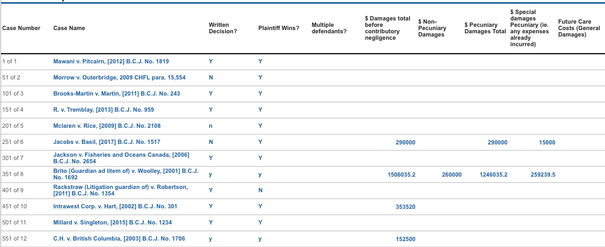
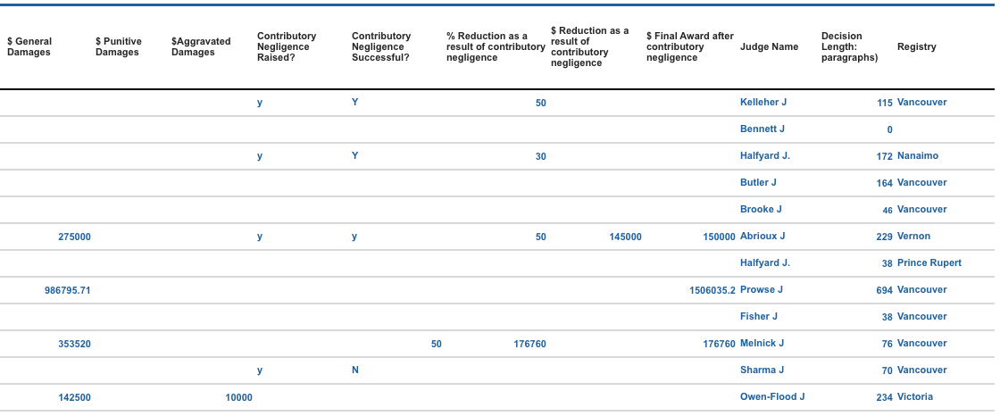

## British Columbia Judicial Decisions Analysis Project plan
### Description
Negligence law is “an area of tort law that deals with the breach of duty to take care and it involves harm caused by carelessness, not intentional harm.”1. As of today there is currently no reliable data regarding the amount of compensation a court awards to injured people in British Columbia. When a negligence case wins, the court awards what are called ‘damages’, a financial amount the injured person is paid from the person who injured them. The damages depend on the category of the harm to the defendant such as punitive damages or aggravated damages.
In this project we are trying to analyze B.C. court negligence cases from the past 20 years and extract some information such as whether the damage awards have gone up during these past 20 years.  There are some challenges with these information extraction processes such as the fact that they were not written in a cohesive format, the damages mentioned in the cases may or may not get awarded to the defendant, or that the data is not annotated. We are aiming to use a combination of rule based methods such as pattern matching and classification algorithms such as tree based models to extract the desired information. 
### Datasets
There are two data sources available for all relevant B.C. court cases. The two sources are LexisNexis and WestLaw Connect. Data is in .DOCX format. For this project we will be only using 4,118 cases from LexisNexis. This data source is roughly 50,000 pages long. Most cases consist of a case summary, Regulations and Rules, counsel, Reasons for Judgment and a conclusion. The data first was converted from .docx files to .txt files for ease of access and manipulation in Python. The detailed explanation and the code for the conversion can be found [here](https://github.ubc.ca/nikihm/Capstone-project/blob/master/code/DOCX%20to%20TXT%20format.ipynb). We will only be looking at British Columbia Judgments (B.C.J)  cases which will reduce the number of cases to 3885.  Out of  B.C.J cases few were crown cases 2, which after removal 3852 cases remain. The data was stored as a zip file on [Github](https://github.ubc.ca/nikihm/Capstone-project/tree/master/data) to preserve space and time. Lachlan Caunt provided 30 annotated cases. An example of annotated data can be found in appendix 1.  
The data was annotated on :
- Case name
- Written decision case(Y/N)
- Plaintiff Wins? (Y/N)
- Multiple defendants (Y/N)
- \$ Damages total before contributory negligence
- \$ Non-Pecuniary Damages
- \$ Pecuniary Damages Total
- \$ Special damages Pecuniary (ie. any expenses already incurred)
- Future Care Costs (General Damages)
- \$ General Damages 
- \$ Punitive Damages 
- \$Aggravated Damages 
- Contributory Negligence Raised?
- Contributory Negligence Successful? 
- % Reduction as a result of contributory negligence
- $ Reduction as a result of contributory negligence
- $ Final Award after contributory negligence
- Judge Name
- Decision Length: paragraphs
- Registry 

### Expected Deliverables

#### Core Deliverables

In general, the core deliverable of our project hopes to answer how negligence payouts have been changing since the year 2000 in BC. Within the provided case data there is enough information to do a comprehensive analysis of this question. The core challenge of the analysis is the time that would take to extract the relevant information needed. See the methods section below for more information on how we plan to extract this information.
To do our analysis, our team will work towards extracting damage fields into a table format and storing it as a .CSV file. We will be performing analysis with this data once it has been pulled out into table format. The analysis will include general statistics such as minimum, maximum, median, and mean payouts. These payouts will be explored with different variables collected such as the year, judge, registry location, or if multiple defendants are present. Along with these, our team will provide a set of visualizations of how the damage payouts have changed in order to more easily digest this information. Visualizations will also be useful for comparing between variables, such as the judge or registry location, to try to see if there is a discrepancy in the amount of damages that are paid out.
To complete our core deliverable our team will initially pull out the following information from the dataset.

- Case Number (String)
- Year (Int)
- Case Name (String)
- Written Decision? (Y/N)
- Plaintiff Wins? (Y/N)
- Multiple Defendants? (Y/N)
- Judge Name (String)
- Decision Length in paragraphs (int)
- Registry (String)
- \$ Total Damages Awarded (float)

There are cases where a damage amount is not listed in the case. There is not much we can do about this missing information therefore the case would simply have a 'None' value for the damage awarded (which is different from a '0' value). Sometimes the judge may state the contributory negligence as a percentage and not provide the damage amount in the case. See our potential deliverables for our plan to handle this.

#### Potential Deliverables

Our team, given enough time, hopes to provide a Python script in order to perform the same analysis on new case files. Our plan is to allow the user to specify a new file via command line and set an output path to where we will take the .DOCX formatted case(s) and convert it to a .CSV containing the extracted data fields. If the user specifies a directory rather than a file the script will attempt to read all .DOCX files within the directory. The limitation of this deliverable is that we can only work with the same format of data that we've been provided; this script will not account for changes in the file format in the future. A secondary script will be used to read in the output .CSV and give a set of statistics about the data that has been extracted in .TXT format. This will include an analysis of basic stats for each of the damage amounts paid out based on each of the extracted fields (per year, per judge, per location, and if multiple defendants are present)
We also plan to pull out more specific fields from the cases to improve our core analysis. As stated in our core deliverable, there are cases that only provide a percentage of contributory negligence rather than a damage payout. Some cases may provide both the damage payout and the contributory negligence. Our plan is to try and capture this information from the case data to provide a more granular set of information extracted. The complete list of these fields we wish to extract is listed in the dataset section above.
As the capstone project proceeds we will be keeping in touch with our capstone partner to determine what information will be most relevant for their analysis. If we are unable to pull out all of the potential fields we can at least attempt to extract the fields that will provide the most amount of usefulness.

### Methods

#### Data Handling
We first converted all .docx files to .txt files for ease of manipulation in Python. This includes all text and tables present in the original files. Tables from the original document will be stored outside of the .txt file for reference. Each file consists of roughly 50 individual negligence cases, separated by an “End of Document” marker.  We plan to store the raw text files on our local machine and have pushed a zip file of the data to Github. Due to the limited volume of data, further database storage/management is not a concern. As part of the final deliverable we will likely export a CSV file with all relevant fields filled in. To the best of our knowledge, we will use the following Python libraries: docx, pandas, numpy, re, matplotlib/altair, sklearn, and nltk. 
Static Information Extraction
To start the information extraction process we are picking up on patterns present in all files and individual documents using regular expressions. Many of the fields listed above can be extracted using pattern matching however, due to variation in structure of the case files, a simple regular expression will not work for extracting the damages awarded in each trial. To verify accuracy of the text extracted for the more straight-forwarded fields of interest (i.e. Registry, Judge Name, Case Number, Decision Length, and Case Name) , we will write tests to ensure the result adheres to the expected format and manually review a handful of results relative to the original documents. 

#### Identifying Damages Awarded
To locate the damages awarded for each case, if any, we will use two main approaches. First, we will build a rule-based method to extract damages using regular expressions and patterns found in the text, though we are unsure how this will perform given the variable structure of written decisions per case. Second, we plan to build a classifier that labels monetary values embedded in the text of each case as either final damages, partial damages, or other numerical values mentioned. In addition to classifying monetary values as damages, or not, we hope to distinguish between the type of damages awarded in each case. The three major categories of damages are:  non-pecuniary, specific, and general.  A key challenge is that we only have 30 annotated documents noting the damages awarded by category. For this reason, we cannot simply train a classifier and evaluate results, we first need to annotate more cases. 
To start, we will explore the texts and identify patterns and features that will likely differentiate damages by category relative to other monetary values mentioned. We will first work to apply a rule-based method to extract damages awarded per case. For this approach, patterns include the mention of phrases such as ‘award’, ‘total damages’, ‘general damages’, in the immediate context surrounding dollar amounts embedded in the text of each case. We will filter the text based on the location of where these values are mentioned prior to applying the patterns. 
Similarly, for our classification approach, a few distinguishing features that come to mind are: context in terms of n-grams before and after the dollar value, location in the text of the value is mentioned, and whether or not it is the last value mentioned. After identifying key features related to damages awarded (dollar values), we  plan to hand-annotate 100+ results for training. To start we plan to use a tree-based classifier such as a simple Decision Tree or XGBoost. To further explore the structure of damages awarded and other categories of damages (non-pecuniary, specific, and general),  we may explore topic modeling using Latent Dirichlet Allocation, analyzing the context surrounding the different values mentioned.

#### Final Report
Once we extract the static information and are able to identify damages awarded by category with high accuracy, our final deliverable will include data analysis on trends in negligence cases over time,  and if time allows, a script that can be used to extract the same information from future cases. The primary trends of interest are how the magnitude of damages awarded in negligence cases have changed over time as well as the change in proportion of cases with contributory negligence. Other trends of interest include: the number of cases in which the Plaintiff wins per year, and the distribution of cases per Judge alongside the corresponding case results. The final report will include data visualizations to demonstrate these trends using a variety of Python data visualization packages and a written summary of our findings in PDF format. If there are no time restrictions, we hope to write a script that will include two major functions. The first function will convert Word .docx files into text files. The second will be an information extraction class method that retrieves static information from each text file as well as a classifier method which categorizes the damages awarded for cases in which the Plaintiff wins.

#### Code Quality Assurance 
For testing our code and performing code reviews, we will have a streamlined procedure in place to ensure code is working as intended prior to finalizing. Although we are each starting with our own experimental Jupyter Notebooks for exploring the texts and information extraction ideas, we will piece together an organized and commented notebook composed of code that is fully functional.  This code will have been successfully applied to all legal cases (over 4,000), which is a test in itself, but will also contain appropriate asserts and will be reviewed by all members of the team via a Github pull-request prior to merging to the master branch of our repository. 

#### Schedule
Meeting schedules
The group will talk everyday at the end of the day for 30 minutes to give updates on work progress and the task that has been checked off.  The group will talk to the capstone supervisor, Julian Brooke, on Wednesdays from 10-11 am. The group and the subject matter expert, Lachlan Caunt, will talk on Fridays 10-11 am. 
Work schedule 
The team’s word schedule is designed in a way that most of the information extraction should be done by week 3. Week 4 is to place all team’s code together and try to create an interface where users can easily visualize graphs and charts. Week 5 schedule is not yet determined since the paste of work is not obvious, however if everything goes according to plan we will dedicate that week to extract more useful data and improve the interface. Below is a detailed schedule for each week and assigned tasks for each team member. In week 6 and 7 as suggested by our mentor we will be focusing on writing the final report and preparing our presentation. 
Table of schedules for each group member for next 5 weeks.

|  Group member | Week1(May 4 - 11)	 | Week2(May 11 - 18)	 | Week3(May 18 - 25) | Week4(May 25 - Jun1)	 | Week5(Jun1 - 8) |
|------------------|-----------------------------------------------------------------|-------------------------------------------------------------------------------|-----------------------------------------------------|-------------------------------------------------------------|--------------------------------------------------------------------|
| Goal of the week	 | 1- Finishing the project plan2- Turning data from .doc to .txt 	 | 1- Extract static information 2- Damages information extraction (Rule-base)	 | - Try tree based approaches for damage extraction  | - Continue with tree based approaches for damage extraction | - Placing  all code together-Evaluation, -Graphs and visualization |
| Ravi | Expected Deliverables.DOCX to .txt | static IE/  damages IE. Extracting damages from conclusion | Feature selection/tuning. Research based on results | Feature selection/tuning. Research based on results | placing code together. Code documentation |
| Ilana | Methods  | static  IE/  damages IE. Extracting damages from summary | Train model/Hyperparameter tuning | Train model/Hyperparameter tuning | Evaluation of the chosen classifier |
| Niki | Description  Dataset schedules  | static  IE/  Annotating the 100 Data Set/ Research on how to use annotations. | Evaluation/picking the best tree classifier  | Evaluation/picking the best tree classifier | Graphs and visualization |

### Appendices: 

#### Appendix 1:
An example of the annotated data:

### References:

1- https://guides.library.utoronto.ca/c.php?g=250653&p=1679869

2- https://www2.gov.bc.ca/gov/content/justice/criminal-justice/bcs-criminal-justice-system/understanding-criminal-justice/key-parts/crown-counsel

